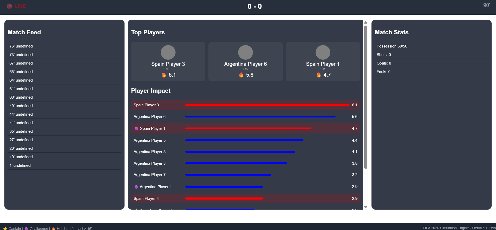
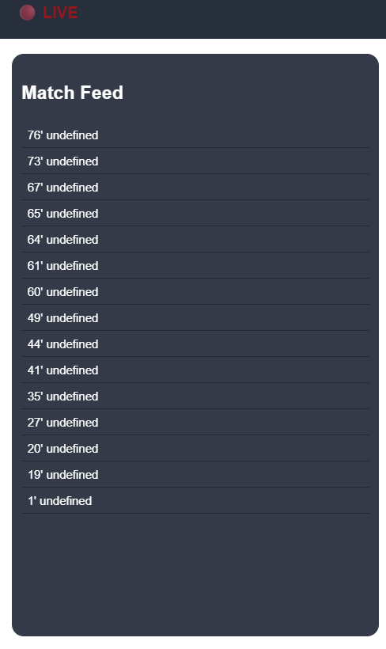
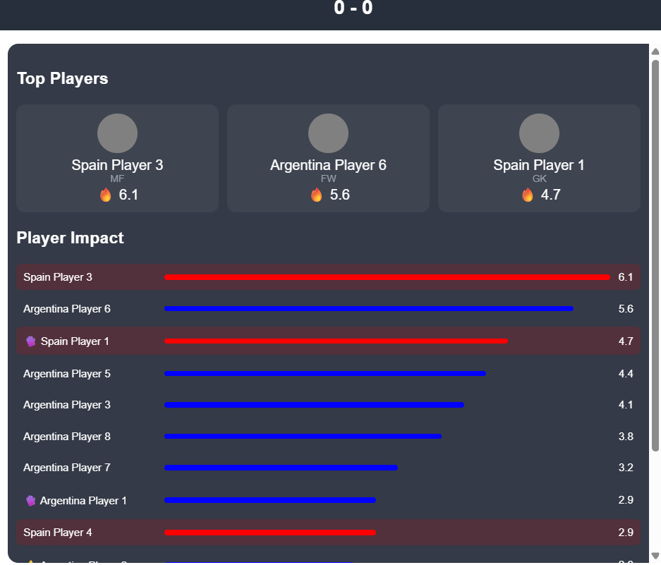

# 🏟️ MVP Board – World Cup Live Engine

A real-time football match simulation engine built with **FastAPI**, featuring:

* ⚽ Live match simulation
* 📊 Player impact ranking
* 🔥 Match event feed
* 📡 WebSocket streaming (v2 ready)
* 🌐 ESPN-style frontend UI

---

## 🚀 How to Run the Project

### 1️⃣ Clone the repository

```bash
git clone https://github.com/robinsonn1/mvp-board.git
cd mvp-board
```

---

### 2️⃣ Create a virtual environment

#### Windows (PowerShell)

```bash
python -m venv .venv
.venv\Scripts\activate
```

#### Mac / Linux

```bash
python3 -m venv .venv
source .venv/bin/activate
```

---

### 3️⃣ Install dependencies

```bash
pip install fastapi uvicorn
```

(Optional but recommended)

```bash
pip install python-multipart
```

---

### 4️⃣ Project structure

Make sure your folders look like this:

```
mvp-board/
│
├── main.py
├── data/
│   └── players.json
├── frontend/
│   └── index.html
```

---

### 5️⃣ Run the server

```bash
uvicorn main:app --reload
```

You should see:

```
Uvicorn running on http://127.0.0.1:8000
```

---

### 6️⃣ Open the app

Open in your browser:

```
http://127.0.0.1:8000/static/index.html
```

---

## 🔌 API Endpoints

### 📊 Match status

```
GET /match/1/status
```

### 🧠 Player impact

```
GET /match/1/impact
```

### 🔥 Match feed (live events)

```
GET /match/1/feed
```

### 📈 Match stats

```
GET /match/1/stats
```

### 🧾 Explain player impact

```
GET /player/{player_id}/explain
```

---

## ⚡ WebSocket (Real-Time Updates)

Connect to:

```
ws://127.0.0.1:8000/ws
```

Example (JavaScript):

```javascript
const ws = new WebSocket("ws://127.0.0.1:8000/ws");

ws.onmessage = (event) => {
    const data = JSON.parse(event.data);
    console.log("LIVE UPDATE:", data);
};
```

---

## 🧠 How the Engine Works

### Impact Score Formula

```
Pass (success)  +0.3
Shot            +2.0
Goal            +10.0
Foul            -1.0
Miss            -0.5
```

### Emojis

* ⭐ Captain
* 🧤 Goalkeeper
* 🔥 High impact player

---

## 🛠️ Tech Stack

* Python
* FastAPI
* Uvicorn
* JavaScript (Vanilla)
* HTML/CSS

---

## 🚀 Future Improvements (v2)

* WebSocket-powered UI (no polling)
* Player heatmaps
* Match timeline visualization
* Real data integration (Opta / APIs)
* WhatsApp alerts (Twilio integration)

---

## 👨‍💻 Author

Robinson Navarro
Technical Account Manager | Building real-time systems

## 📸 Screenshots

### 🏟️ Dashboard


### 🔥 Live Match Feed


### 📊 Player Rankings
